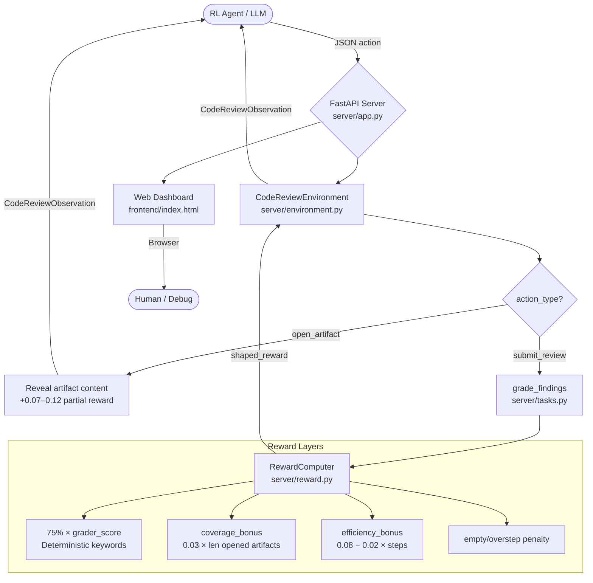

# 🔍 CodeReview-Env

> **A production-grade OpenEnv Reinforcement Learning environment** for training LLM agents
> to write high-quality, actionable code reviews across three difficulty tiers — built for the
> **Meta × PyTorch × HuggingFace OpenEnv Hackathon 2026**.

[](https://github.com/huggingface/openenv)
[](https://huggingface.co/spaces/Anurag137/codereview-env)
[](https://github.com/anuragverma025/Meta)
[](https://python.org)
[](https://docker.com)
[](https://github.com/huggingface/trl)

---

## 🎯 What Problem Does This Solve?

Every software team spends **6–12 hours per week** on code reviews. Yet most LLMs today produce generic, unhelpful feedback — _"Looks good!"_, _"LGTM"_ — that misses real bugs and security vulnerabilities.

**CodeReview-Env** creates a rigorous RL training ground where an agent must:

| Skill | What the Agent Learns |
|---|---|
| 🐛 **Bug Detection** | Spot off-by-one bugs, dangerous Python negative-index slicing |
| 🔒 **Security Auditing** | Catch IDOR / cross-tenant data leaks, missing admin-role gates |
| ⚡ **Concurrency Analysis** | Diagnose TOCTOU races, duplicate refunds, missing idempotency keys |
| 📝 **Actionable Writing** | Produce structured findings: `title`, `file_path`, `line_hint`, `severity`, `rationale`, `recommendation` |

> **Before vs. After RL Training:**
>
> | What | Standard LLM | CodeReview-Env RL Agent |
> |---|---|---|
> | Review text | "Looks good, maybe add a test." | "**Critical**: `account_id` is taken from the query string without scope validation — any authenticated user can export another tenant's invoices. Call `require_account_scope(request, account_id)` before exporting." |
> | Grader score | ~0.08 | ~0.78 |
> | Artifacts opened | 0 | 3 |

---

## 🏗️ System Architecture



---

## 🗂️ Tasks (Easy → Medium → Hard)

All tasks model **real engineering incidents** with deterministic, keyword-based graders — no LLM-as-a-judge flakiness for the core reward signal.

### 🟢 Easy — `pagination-regression` (step_limit: 4)

**Scenario**: A pagination helper was patched after customers reported duplicate rows on page 2. The formula changed from `start = page * page_size` to `start = (page - 1) * page_size`.

**Core finding the agent must catch**:
- The 1-indexing fix is correct for pages ≥ 1 — but page 0 or negative pages now produce **dangerous negative-index slices** (`items[-10:0]`), silently returning rows from the **end** of the list.

**Artifacts available**:
| Artifact | Kind | Exploration Reward |
|---|---|---|
| `ticket` | Support ticket | (starting artifact) |
| `helper_diff` | `utils/pagination.py` diff | +0.08 |
| `test_log` | Failing test excerpt | +0.10 |

**Grader criteria**:
1. `page-zero-validation` (weight: 0.60) — Must mention page 0 / negative pages / negative-index slicing + recommend a guard/`ValueError`.
2. `off-by-one-context` (weight: 0.35) — Must confirm the 1-indexing fix is correct and why.

---

### 🟡 Medium — `tenant-export-auth` (step_limit: 5)

**Scenario**: A finance CSV-export endpoint (`/api/admin/invoices/export`) was added for admins in a multi-tenant SaaS. The route reads `account_id` from the query string.

**Core findings the agent must catch**:
1. **Missing tenant scope** — No call to `require_account_scope(request, account_id)` → any authenticated user can export another tenant's invoices by passing an arbitrary `account_id`.
2. **Missing admin gate** — No call to `require_admin(request)` → the route is accessible to non-admin users if discovered.

**Artifacts available**:
| Artifact | Kind | Exploration Reward |
|---|---|---|
| `pr_summary` | PR description | (starting artifact) |
| `route_diff` | `api/admin_exports.py` diff | +0.08 |
| `auth_middleware` | `middleware/authz.py` | +0.12 |
| `security_policy` | Tenant isolation policy | +0.10 |

**Grader criteria**:
1. `missing-tenant-scope` (weight: 0.65) — Must mention cross-tenant / account scope / data leak + recommend `require_account_scope`.
2. `missing-admin-gate` (weight: 0.30) — Must note `require_admin` is never called.

---

### 🔴 Hard — `refund-idempotency` (step_limit: 6)

**Scenario**: Duplicate refunds occurred during a processor outage. A worker retry patch was applied, but the root cause was not fully fixed.

**Core findings the agent must catch (3 distinct issues)**:
1. **Retry without idempotency** — On `TimeoutError`, the worker calls `payments.refund()` a second time without reusing a durable `idempotency_key`, even though the processor may have already accepted the first refund.
2. **Status-update race** — `status` is only written to the DB **after** the processor call returns. A second worker can pick the same queued job during the visibility timeout window and race another refund.
3. **Missing regression test** — No test covers timeout-after-success or concurrent replay scenarios.

**Artifacts available**:
| Artifact | Kind | Exploration Reward |
|---|---|---|
| `incident_ticket` | Incident summary | (starting artifact) |
| `worker_diff` | `workers/refunds.py` diff | +0.08 |
| `payment_client` | `integrations/payments.py` | +0.12 |
| `db_model` | `models/refund.py` schema | +0.08 |
| `worker_log` | Concurrent worker log | +0.10 |
| `regression_test` | Missing test note | +0.07 |

**Grader criteria**:
1. `retry-without-idempotency` (weight: 0.50)
2. `status-update-race` (weight: 0.30)
3. `missing-regression-test` (weight: 0.15)

---

## ❓ Why the Hard Task Is Hard — Agent Failure Analysis

The `refund-idempotency` task has the lowest baseline score (~0.38) for concrete reasons rooted in the RL observation dynamics:

| Failure Mode | Root Cause | Fix |
|---|---|---|
| **Misses the race condition** | Agent does not open `worker_log`, which is the only place where `worker-b` picking the same job is documented | Must open `worker_log` _before_ submitting |
| **Mentions "retry" but not "idempotency_key"** | The `payment_client` artifact is the only place `idempotency_key=None` is visible as a default. Agents skip it. | Must open `payment_client` |
| **Ignores the test gap** | `regression_test` artifact has the lowest reward (+0.07) so agents deprioritize it | Must open `regression_test` to hit criterion 3 |
| **Status race detection** | The code path ("status written only after the call") is subtle and requires cross-referencing `worker_diff` + `worker_log` together | Multi-artifact correlation required |

This is a genuine RL challenge: the agent must learn to **invest in evidence** (artifact exploration) before the grader can reward a complete, multi-finding submission.

---

## ⚖️ Grader Design — How Scoring Works

Each criterion is evaluated with a **five-factor formula**:

```
criterion_score = weight × (
    0.45 × issue_score        # keyword coverage of required_terms
  + 0.25 × fix_score          # keyword coverage of recommendation_terms
  + 0.15 × severity_score     # exact severity label match
  + 0.10 × file_score         # correct file_path in finding
  + 0.05 × evidence_score     # preferred artifacts were opened
)
```

The final `shaped_reward` at submission:

```
shaped_reward = clamp(
    grader_score × 0.75
  + coverage_bonus            # 0.03 × num_opened_artifacts (max 0.12)
  + efficiency_bonus          # 0.08 − 0.02 × max(0, steps − 2)
  + empty_submission_penalty  # −0.12 if no findings, −0.01 otherwise
  + overstep_penalty          # −0.05 if steps > step_limit
, 0.05, 0.95)
```

### 📊 Reward Sensitivity Table

How score changes based on finding quality (example: `tenant-export-auth`):

| Agent Behavior | Approximate Score |
|---|---|
| Submits empty review | ~0.05 |
| Says "might have auth issue" (no structure) | ~0.12 |
| Mentions `cross-tenant` + correct file, no recommendation | ~0.35 |
| Correct finding, wrong severity label | ~0.51 |
| Full finding: tenant scope + admin gate, 2 artifacts opened | ~0.72 |
| All findings, correct severity, all recommended artifacts opened | ~0.91 |

> All scores are clamped to `[0.05, 0.95]` in the grader (`_clamp_score`) and to `[0.05, 0.95]` in the environment reward accumulator. The public API never returns exactly 0.0 or 1.0.

---

## 🔄 Action & Observation Space

### Action Space

```json
// Explore: open an artifact for context (+0.07 to +0.12 reward)
{
  "action_type": "open_artifact",
  "artifact_id": "auth_middleware",
  "note": "Need to check what auth helpers are available."
}

// Submit: structured findings (graded; terminates episode)
{
  "action_type": "submit_review",
  "findings": [
    {
      "title": "Export route missing tenant scope enforcement",
      "file_path": "api/admin_exports.py",
      "line_hint": "export_invoices",
      "severity": "critical",
      "rationale": "account_id is taken from query params without scope validation — any authenticated user can export another tenant's invoices.",
      "recommendation": "Call require_account_scope(request, account_id) and require_admin(request) before exporting."
    }
  ],
  "note": "Merge blocker — critical security flaw."
}
```

### Observation Space

| Field | Type | Description |
|---|---|---|
| `task_id` | str | Active task ID |
| `difficulty` | easy / medium / hard | Task tier |
| `title` | str | Task title |
| `objective` | str | What the reviewer must determine |
| `summary` | str | Engineering context |
| `step_limit` | int | Maximum allowed steps |
| `available_artifacts` | list | All artifacts (preview only if not opened) |
| `opened_artifacts` | list | Artifacts opened this episode (with full content) |
| `recent_events` | list[str] | Last 6 environment events |
| `last_action_error` | str | Error message if last action failed |
| `score` | float ∈ (0.05, 0.95) | Running score after submission |
| `reward` | float | Reward earned on this step |
| `done` | bool | Whether the episode has ended |
| `metadata` | dict | Extra: `step_count`, `opened_artifact_ids`, `reward_breakdown` |

---

## 🛡️ Safety Layer

The codebase includes `codereview_env/safety.py` with two enforcement classes:

- **`PaginationValidator`** — Guards `page` and `page_size` inputs against type errors, negative values, and oversized pages before they reach the underlying `get_paged_items` function.
- **`SafeRewardCalculator`** — Wraps raw reward computation with a final `max/min` clamp and rounds only at the last output step (per `config.py` precision settings).

All boundary math is centralized in `codereview_env/config.py`:

```python
RewardConfig(MIN_REWARD=0.05, MAX_REWARD=0.95, DECIMAL_PRECISION=4, BONUS_COEFFICIENT=0.75)
PaginationConfig(MIN_PAGE=1, MAX_PAGE_SIZE=100, DEFAULT_PAGE_SIZE=10)
```

---

## 📡 API Reference

| Endpoint | Method | Description |
|---|---|---|
| `/` | GET | Interactive web dashboard |
| `/health` | GET | Liveness check: `{"status": "ok", "task_count": 3, "tasks": [...]}` |
| `/tasks` | GET | List all 3 tasks with metadata |
| `/tasks/{task_id}` | GET | Full task detail + artifact list |
| `/metadata` | GET | Environment metadata (name, domain, tasks) |
| `/reset` | POST | Start episode: `{"task_id": "pagination-regression"}` |
| `/step` | POST | Execute action: `{"session_id": "...", "action": {...}}` |
| `/state` | GET | Current episode state (latest session) |
| `/state/{session_id}` | GET | Current episode state (specific session) |
| `/grade` | POST | One-shot grading (no session needed) |
| `/demo` | GET | Side-by-side bad vs. good review demo |
| `/docs` | GET | Interactive Swagger UI |

---

## 🤖 Training with GRPO (TRL)

CodeReview-Env is designed to plug directly into **TRL's GRPO** training loop.

### Recommended Hyperparameters

```python
from trl import GRPOConfig

GRPOConfig(
    output_dir="codereview-grpo-model",
    learning_rate=1e-5,               # Low LR — reward signal is dense but sparse in early episodes
    per_device_train_batch_size=4,
    gradient_accumulation_steps=2,    # Effective batch = 8
    num_train_epochs=3,
    logging_steps=10,
    # Reward function: plug in our environment client (see examples/run_grpo_training.py)
)
```

### Reward Function Integration

```python
from codereview_env.client import CodeReviewEnv

env = CodeReviewEnv(base_url="http://localhost:7860").sync()

def openenv_reward_function(completions, prompts, **kwargs):
    rewards = []
    for prompt, completion in zip(prompts, completions):
        res = env.get_reward_breakdown(completion)
        rewards.append(res.get("total_reward", 0.05))
    return rewards

# Pass to GRPOTrainer(reward_funcs=[openenv_reward_function], ...)
```

See [`examples/run_grpo_training.py`](examples/run_grpo_training.py) for the full setup.

---

## 🚀 Quick Start

### Local Development

```bash
# 1. Clone
git clone https://github.com/anuragverma025/Meta.git
cd Meta/codereview_env

# 2. Install (editable)
pip install -e ".[dev]"

# 3. Configure
cp .env.example .env
# Edit .env: set API_BASE_URL, API_KEY, and optionally MODEL_NAME

# 4. Start the server
uvicorn server.app:app --host 0.0.0.0 --port 7860

# 5. Health check
curl http://localhost:7860/health

# 6. Run baseline inference
API_BASE_URL=https://api-inference.huggingface.co/v1 \
API_KEY=hf_xxx \
MODEL_NAME=Qwen/Qwen2.5-72B-Instruct \
python inference.py
```

### 🐳 Docker

```bash
# Build
docker build -t codereview-env .

# Run
docker run -p 7860:7860 \
  -e API_BASE_URL=https://api-inference.huggingface.co/v1 \
  -e API_KEY=hf_xxx \
  -e MODEL_NAME=Qwen/Qwen2.5-72B-Instruct \
  codereview-env

# Verify
curl http://localhost:7860/health
curl http://localhost:7860/tasks
```

### 🤗 HuggingFace Spaces

**Live Demo**: [huggingface.co/spaces/Anurag137/codereview-env](https://huggingface.co/spaces/Anurag137/codereview-env)

```bash
git remote add hf https://huggingface.co/spaces/Anurag137/codereview-env
git push hf main
```

---

## 📊 Baseline Scores

Measured with `Qwen/Qwen2.5-72B-Instruct` via HuggingFace Inference API, using the scripted fallback policy in `inference.py`:

| Task | Score | Steps Used | Key Artifact Opened | Outcome |
|---|---|---|---|---|
| `pagination-regression` | ~0.74 | 2 | `test_log` | ✅ Pass |
| `tenant-export-auth` | ~0.61 | 3 | `auth_middleware` + `security_policy` | ✅ Pass |
| `refund-idempotency` | ~0.38 | 4 | `payment_client` + `worker_log` | ❌ Needs training |
| **Average** | **~0.58** | | | |

> Scores are always in `(0.05, 0.95)` — never exactly 0 or 1 by the `_clamp_score` invariant enforced at every layer.

**Success threshold** for baseline evaluation: `score >= 0.60` (configured in `inference.py` as `SUCCESS_SCORE_THRESHOLD`).

---

## 📁 Project Structure

```
codereview_env/
├── Dockerfile                  # Root-level — HF Spaces requirement
├── openenv.yaml                # OpenEnv spec: tasks, reward_range, episode config
├── inference.py                # Baseline inference script (OpenAI client, [START]/[STEP]/[END])
├── HACKATHON.md                # Hackathon impact statement
│
├── server/
│   ├── app.py                  # FastAPI routes (reset, step, grade, demo, state, health)
│   ├── environment.py          # CodeReviewEnvironment (reset / step / state / _build_observation)
│   ├── tasks.py                # 3 ReviewTask definitions + deterministic keyword graders
│   ├── reward.py               # RewardComputer (artifact_reward / submission_reward / invalid_action)
│   ├── dataset_loader.py       # microsoft/CodeReviewer loader + task fallback
│   └── requirements.txt        # Server + FastAPI dependencies
│
├── codereview_env/             # Python package
│   ├── models.py               # Pydantic: ReviewFinding, CodeReviewAction, CodeReviewObservation, CodeReviewState
│   ├── client.py               # Async HTTP client for remote environments
│   ├── safety.py               # PaginationValidator + SafeRewardCalculator
│   └── config.py               # Centralized config: reward bounds, pagination limits
│
├── frontend/
│   └── index.html              # Real-time web dashboard (vanilla JS)
│
├── examples/
│   ├── run_basic_agent.py      # Single complete episode demo
│   ├── run_benchmark.py        # Full benchmark across all tasks
│   └── run_grpo_training.py    # TRL GRPO training integration
│
└── tests/
    ├── test_environment.py     # Environment reset/step/state tests
    ├── test_models.py          # Pydantic model validation tests
    ├── test_reward.py          # RewardComputer unit tests
    ├── test_safety.py          # PaginationValidator + SafeRewardCalculator tests
    ├── test_client.py          # HTTP client tests
    └── test_inference.py       # Inference script smoke tests
```

---

## 🔗 Links

| Resource | URL |
|---|---|
| 🤗 Live HF Space | https://huggingface.co/spaces/Anurag137/codereview-env |
| 💻 GitHub Repository | https://github.com/anuragverma025/Meta |
| 📖 OpenEnv Specification | https://github.com/huggingface/openenv |
| 📦 HuggingFace TRL | https://github.com/huggingface/trl |
| 📊 CodeReviewer Dataset | https://huggingface.co/datasets/microsoft/CodeReviewer |

---

## 🙏 Credits

- [OpenEnv](https://github.com/huggingface/openenv) — RL environment specification by Meta × HuggingFace
- [microsoft/CodeReviewer](https://huggingface.co/datasets/microsoft/CodeReviewer) — Training dataset
- [HuggingFace TRL](https://github.com/huggingface/trl) — GRPO / PPO RL training utilities
- Compatible with: **TRL**, **Unsloth**, **SkyRL**, **openenv-core**

---

## 📄 License

MIT License — see [LICENSE](LICENSE).

Built with ❤️ for the **Meta × PyTorch × HuggingFace OpenEnv Hackathon 2026**
